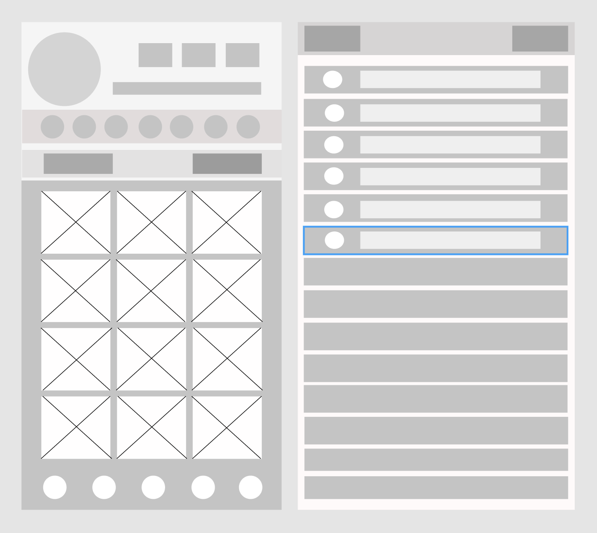

===

# Instagram Clone App

## Table of Contents
1. [Overview](#Overview)
1. [Product Spec](#Product-Spec)
1. [Wireframes](#Wireframes)
2. [Schema](#Schema)

## Overview
### Description
Instagram clone application 

### App Evaluation
- **Category:**  Social 
- **Mobile:** Camera, location, audio, sensors, push, real-time.
- **Story:** Users can create and share their creations/ideas/lives with friends and family through videos, photos and live stories. 
- **Market:** Female/Male - 12yrs+ 
- **Habit:** Creative application - User has tools to create content. Average user uses app 2-3 hours/day. 
- **Scope:** Basic functionalities then build optional stories. 

## Product Spec

### 1. User Stories (Required and Optional)

**Required Must-have Stories**

* User should be able to login to Instagram App successfully.
* User should be able to see the timeline with latest posts.
* User should be able to post a new picture to instagram.
* User should be able to sign up for Instagram and then login successfully.
* User should get appropriate validation error messages when tries to login with incorrect credentials.
* User can like, comment the posts of other friends.
* User can message friends and comment on the statuses.
* User can upload a video as a post.
* User can follow other people/pages.
* User can post a story to Instagram.
* User can save posts.
* User can view their save posts and liked posts. 
* User can put a location to their photos/videos. 

**Optional Nice-to-have Stories**

* User should be able to reset or, change their password.
* User can add boomerang using instagram.
* User can use the instagram live feature. 
* User can send voice messages. 
* User can send photos/videos through private messaging. 

### 2. Screen Archetypes

* Login Screen
   * User can login from this screen
   * User can also make a segue to Registration screen from here incase the user is not registered.
   * User can also request for a reset password request from this screen
* Registration Screen
   * User can create a their new account from this screen
* Posting Content
   * User can create their multimedia content from this screen
* Streaming Content
   * User can stream content
* Live feed
   * The User can scroll through the interactive feed and like, comment and share from this screen. 
   * The user can also revert back any action from this screen
* Search User/Content
   * User can search for any other user or, content
* Live Communication
   * User can establish live communication with other users via text, voice or, video format
   * User can send and recieve pre-recorded media via this screen
   
### 3. Navigation

**Tab Navigation** (Tab to Screen)

* Home Feed
* Search User
* Post Photo/Video
* Direct Message
* Stream Video 

**Flow Navigation** (Screen to Screen)

* Login Screen
   * => Home Feed
   * => Registration screen
   * => Reset/Forgot Password screen
* Registration Screen
   * => Confirmation Screen
   * => Home Feed
* Reset/Forgot Password Screen
   * => Confirmation Screen
   * => Home Feed
* Creation Screen
   * => Home Feed
   * => Few different screen depending on the creation level
* Stream Screen
   * => Back to Home/ Some other actions.
* Search screen
   * => The search feed
   * => The searched users public timeline 
* Direct message
   * => Home feed
 

## Wireframes

## Schema 
[This section will be completed in Unit 9]
### Models
[Add table of models]
### Networking
- [Add list of network requests by screen ]
- [Create basic snippets for each Parse network request]
- [OPTIONAL: List endpoints if using existing API such as Yelp]
